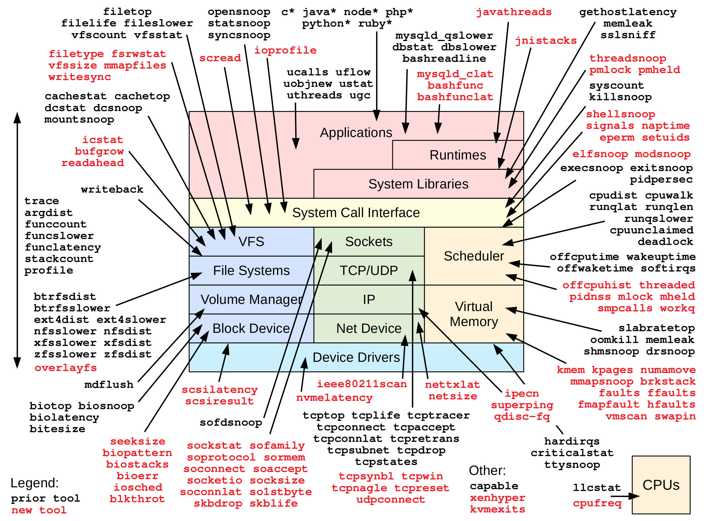

# BPF Performance Tools

This is the official repository of BPF (eBPF) tools from the book [BPF Performance Tools: Linux and Application Observability](http://www.brendangregg.com/bpf-performance-tools-book.html). The directories are:

- [originals](originals): The original published version of the tools.
- [updated](updated): Updated versions of the tools.
- [exercises](exercises): Exercise solutions.

These tools are documented in the book.

#### Tools:

In red are many of the new tools developed for the book, which are all in this repository. In black are the prior tools from BCC and bpftrace, many of which are also covered in the book.

## Updated tools

You may contribute updated versions of the tools to the updated/ directory as you find they need fixes for newer kernels or other distributions (which can change CONFIG options or library paths, changing the probes). Please avoid ifdef's where possible, and create separate tools as they can be tested and maintained independently. Filename examples:

- opensnoop_5.4.bt: opensnoop.bt for Linux 5.4 onwards
- opensnoop_redfrog.bt: opensnoop for the RedFrog Linux distribution (I made that up).
- opensnoop_redfrog11.bt: opensnoop for RedFrog release 11 onwards.
- opensnoop_redfrog11_5.4.bt: opensnoop for RedFrog release 11 onwards, with Linux 5.4 onwards.

By contributing updates to this repository, you agree that the publisher has the necessary permissions to include your updates in possible later editions of the book. Attribution will be given: make it clear in the PR what your name is. Note that the tools are deliberately short to serve as textbook examples and to simplify maintenance, and updates should not add functionality. For that, see the next section.

## Enhanced tools

A small selection of tools from this book has been added to the bpftrace and BCC repositories. It is expected that the BCC versions will be enhanced with various command line options. We are not planning to add any more of these tools to those repositories: they are limited to ensure that they can be well supported by the repository community.
